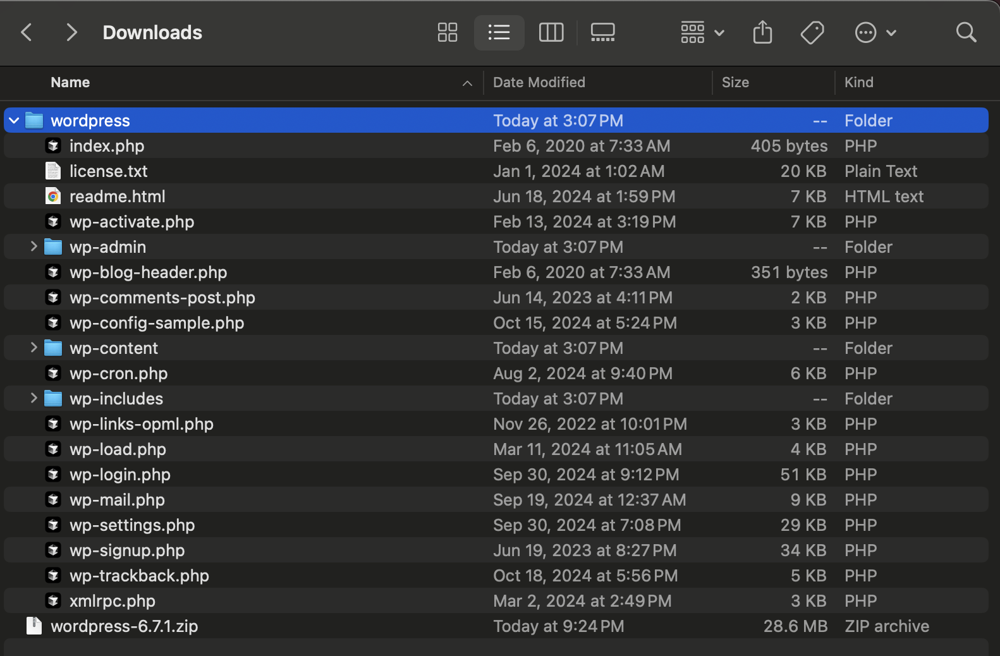
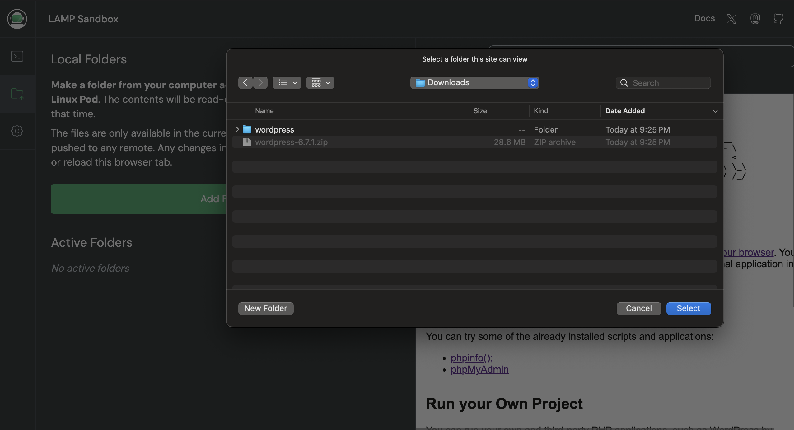
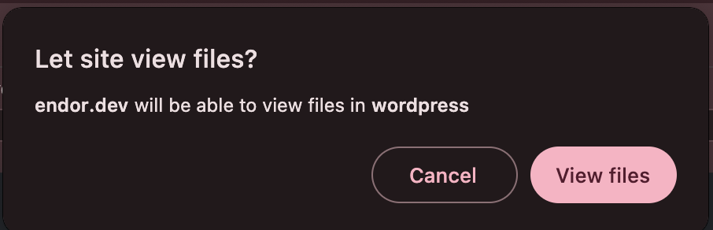
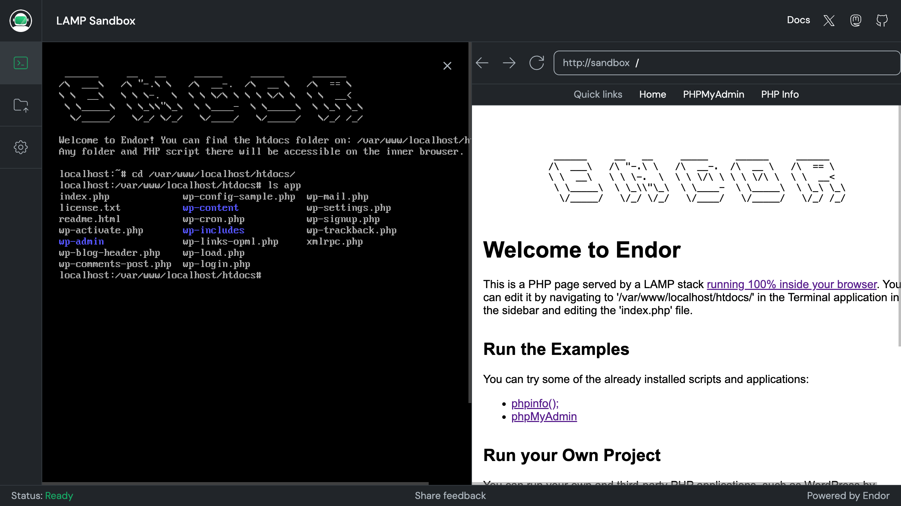
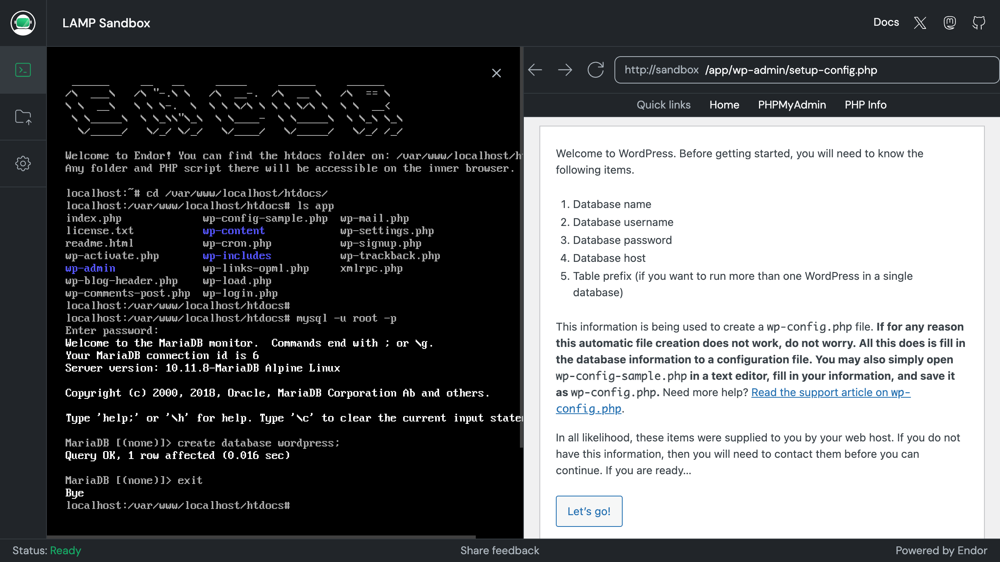
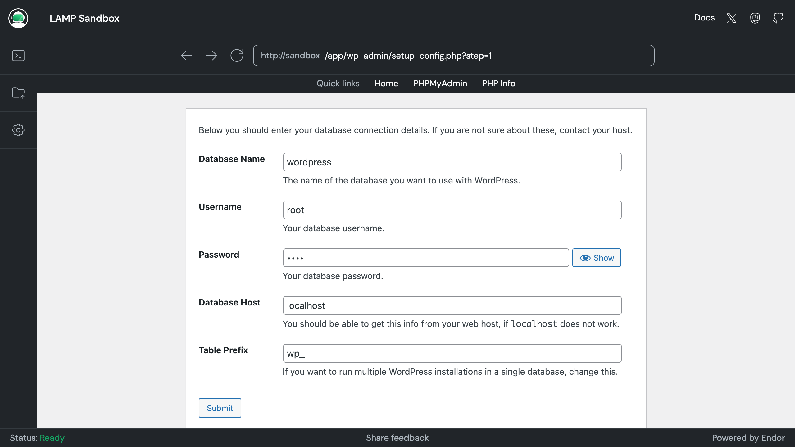
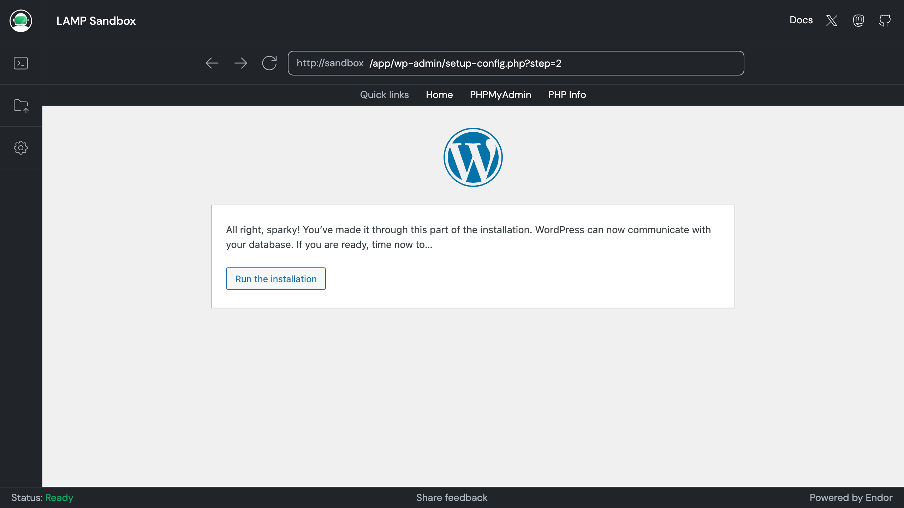
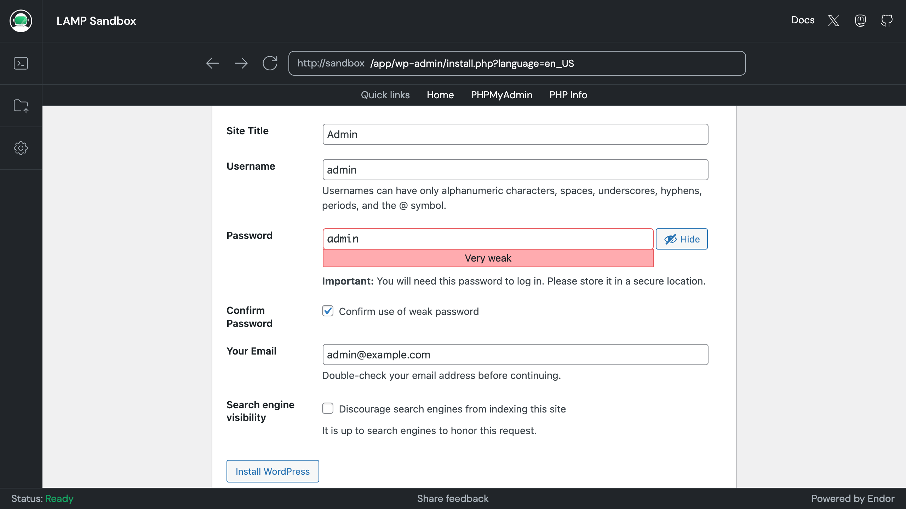
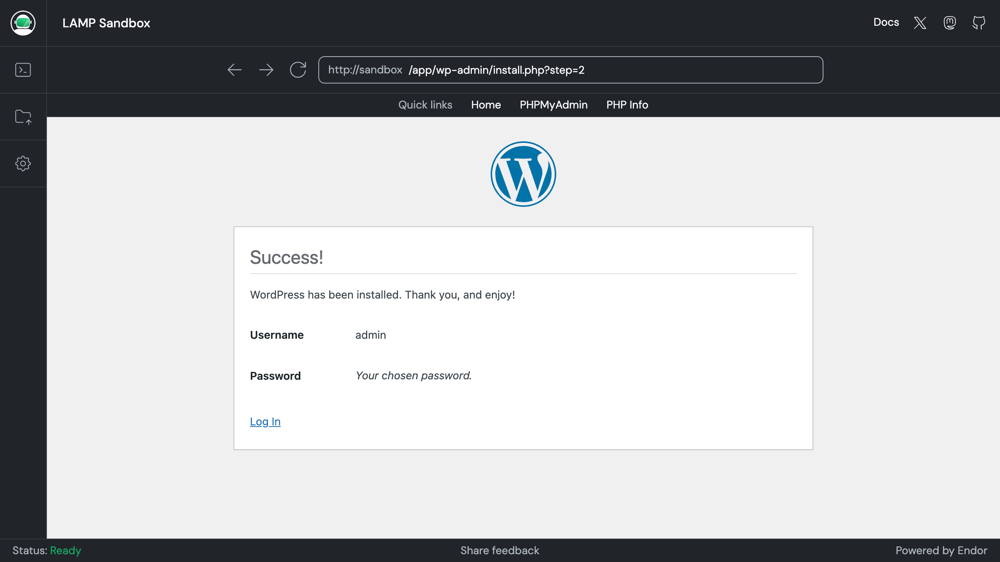

## Installing and Running Wordpress

Navigate to [Download WordPress](https://wordpress.org/download/) to download the source code of WordPress to your computer. The file will be named `wordpress-6.7.1.zip` or similar

You can unzip the file locally in your computer.




Next, you need to add the folder to Endor. This means the files will be accessible from inside the Endor pod. To do so you can click on the folder icon on the left of the page, then click on the Add Folder button. A file selection dialog will appear. Select the `wordpress` folder.



A pop up dialog will ask you to confirm you want the browser to have read only access to the folder and its files



The files are now accessible from inside the Endor pod. If you navigate to the built-in terminal, you will see the files are located inside the app



Create a wordpress database, using phpMyAdmin or the command line. If you do it from the command line, you need to execute the following command, using `root` as both the username and password.

```shell
mysql -u root -p
```

Then, issue `create database wordpress;` and exit the tool. You are now ready to run the WordPress installer by navigating to `/app/wp-admin/setup-config.php` in the built-in browser.





After pressing 'Let's go!', you will enter the values needed to connect to the database. 



If all goes well you will see a screen that directs you to run the installation proper:



In the installation screen you can provide the name for your site as well as an username and password to access the admin section of WordPress.



IF all goes well, you should see a success screen.



You can now visit `/app/` in the bundled browser to access your new site.


Change WP_HOME and WP_SITEURL
