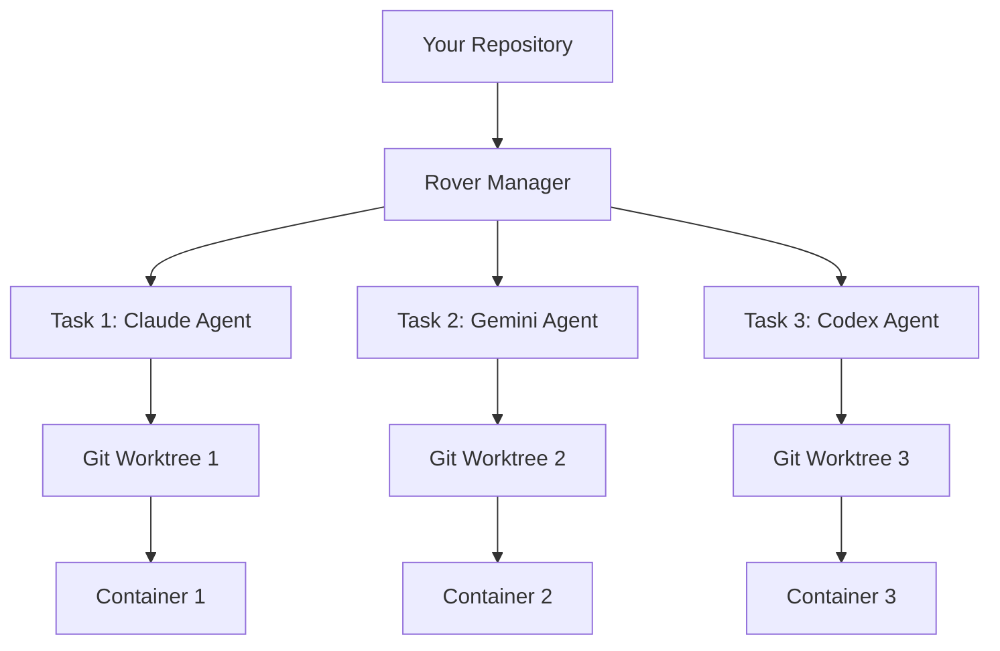

## How Rover Works

### 1. Initialization
```bash
rover init .
```
- Analyzes your project structure and requirements
- Detects available AI agents and development tools
- Creates Rover configuration without modifying your codebase

### 2. Task Creation
```bash
rover task
```
- Creates isolated Git worktree for the task
- Spins up containerized environment
- Configures selected AI agent with project context
- Executes predefined workflow until completion

### 3. Task Management
```bash
rover ls -w          # List tasks with watch mode
rover inspect 1      # Inspect task results
rover iterate 1      # Add new instructions
rover shell 1        # Access task environment
rover merge 1        # Merge changes to main branch
```

### 4. Parallel Execution

Multiple tasks can run simultaneously, each in complete isolation:



## Development Workflow

### Prerequisites
- **Node.js 22.17.0** (exact version required)
- **npm 10.9.2** (exact version required)
- **Git** for version control
- **Docker** for containerization
- **Supported AI Agent** (Claude Code, Codex, Gemini, or Qwen)
