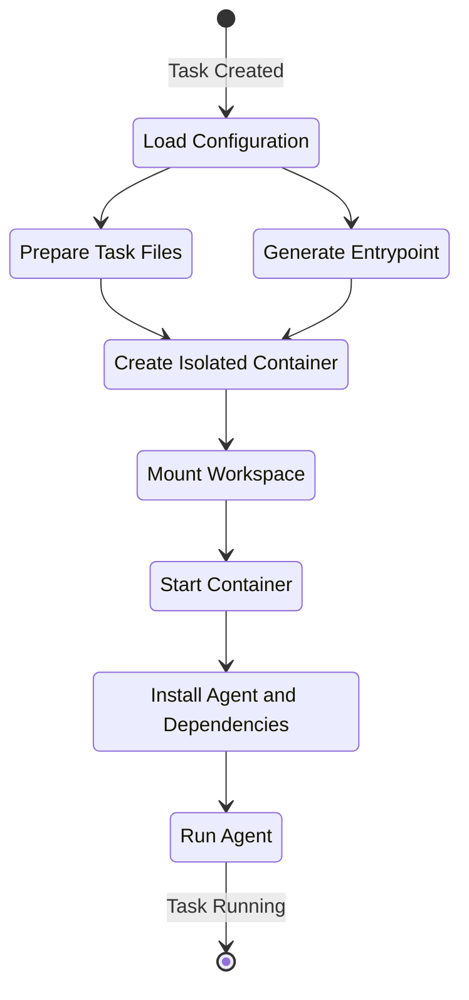

import { CardGrid, LinkCard } from '@astrojs/starlight/components';

The sandbox is the environment Rover uses to complete your [tasks](/rover/concepts/task) in isolation. Each coding agent gets its own sandbox to ensure that changes made during task execution do not interfere with your local machine or other tasks.

A sandbox includes:

- A dedicated [workspace](/rover/concepts/workspace), which contains a copy of your project files
- An isolated execution environment, where the coding agent can run commands without affecting your local machine
- A set or preinstalled tools to help the coding agent complete the [task](/rover/concepts/task)

Currently, sandboxes are implemented using containers. This ensures that each task runs in a consistent environment, regardless of the host machine's configuration. Over time, we plan to support additional sandboxing methods.

## How it works

When you create a new task with `rover task`, Rover sets up a sandbox for it. This involves:

1. **Creating a [workspace](/rover/concepts/workspace)**, which has copy of your project files
2. **Load the user configuration to set up the sandbox environment**. This includes MCP servers, environment variables, and any [other settings defined in the configuration](/rover/config/project-config)
2. **Defines an entrypoint file to initialize the sandbox environment**. This file includes setup steps like installing dependencies and starting MCP servers
3. **Spinning up a containerized environment** using Docker or Podman container runtimes
4. **Running the coding agent inside the sandbox**, allowing it to execute commands and make changes in isolation
5. **Monitoring the task's progress** and capturing outputs, logs, and any changes made within the sandbox

The following diagran illustrates the sandbox process:

## Supported backends

| Backend | Description | Installation |
|---------|-------------|--------------|
| Docker  | Uses Docker containers to create isolated sandboxes for each task. | [Get Docker](https://docs.docker.com/get-docker/) |
| Podman  | Uses Podman containers as an alternative to Docker for sandboxing tasks. | [Get Podman](https://podman.io/getting-started/installation) |

Ensure you have one of these installed and running on your machine to use Rover.

## Sandbox images

The sandbox environment is built on a lightweight, security-focused foundation:

- **Base OS**: Alpine Linux (on Node.js 24)
- **Node.js**: Version 24.x (LTS)
- **npm**: Bundled with Node.js
- **Architectures**: amd64 (x86_64) and arm64 (aarch64)

**Why Alpine Linux?** Alpine is a minimal Linux distribution designed for security and efficiency, providing fast container startup times ideal for isolated execution environments.

### Pre-installed Development Tools

#### Language Runtimes

- **Node.js 24**: JavaScript and TypeScript runtime
- **Python 3**: Python interpreter with uv package manager

#### MCP Server Support

The sandbox includes several **Model Context Protocol (MCP)** servers and utilities, allowing AI agents to integrate with tools and services:

- [package-manager-mcp](https://github.com/endorhq/package-manager-mcp): Pre-installed for package management operations (see the section below)
- [mcp-remote](https://github.com/geelen/mcp-remote): npm package to connect to remote MCP servers when the coding agent does not support it natively

#### Package Management

Multiple package managers are available:

| Package Manager | Purpose |
|----------------|---------|
| **npm** | Node.js packages |
| **apk** | Alpine Linux system packages |
| **uv** | Python package management |
| **Nix** | Cross-platform package manager |

### Installing System Tools

The sandbox includes the [`package-manager-mcp` server](https://github.com/endorhq/package-manager-mcp), which allows coding agents to install additional system tools as needed. For example, to install `curl`, they can install it via an MCP tool. 

**The MCP limits the ability to install packages to the distribution package manager**, ensuring security and stability within the sandbox. In the current image, this means only `apk` can be used to install system packages.

## Next Steps

<CardGrid>
  <LinkCard title="Overview" href="/rover/intro/overview" description="Get started with the Rover CLI" />
  <LinkCard title="Task" href="/rover/concepts/task" description="Learn about Rover tasks and how to manage them" />
  <LinkCard title="Workflow" href="/rover/concepts/workflow" description="Learn how workflows guide coding agents to complete tasks" />
  <LinkCard title="Workspace" href="/rover/concepts/workspace" description="Explore the workspace where coding agents apply changes" />
</CardGrid>
