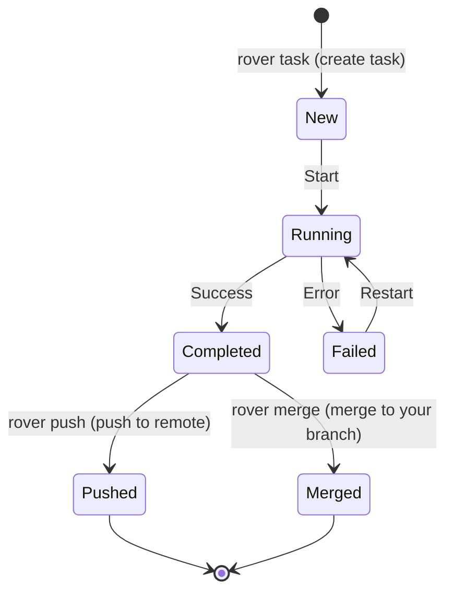

import { FileTree } from '@astrojs/starlight/components';
import { CardGrid, LinkCard } from '@astrojs/starlight/components';

Rover manages your requests as tasks. Each task is an unit of work for Rover and it contains:

- Your initial description, enhanced with a coding agent
- A selected coding agent to complete it
- A [workflow](/rover/concepts/workflow) to guide the coding agent and complete your request
- A separate [workspace](/rover/concepts/workspace) to apply the changes
- Its own [sandboxed environment](/rover/concepts/sandbox) to run in isolation
- Associated metadata, like status, history, generated files, etc.

Tasks can run in parallel, and **you can create as many as you want**. Each task is independent from the others, so you can stop, restart, inspect, debug, or delete them individually.

## Task Storage

Rover stores all task data in the [global store](/rover/advanced/global-store), keeping your repository clean. Each task has its own folder inside `~/.rover/data/projects/<project-id>/tasks/`. The folder name is the unique task ID assigned when you create it.

<FileTree>
- ~/.rover/data/projects/\<project-id\>/
  - tasks/
    - 1/
    - 2/
      - description.json
      - iterations/
        - 1/
          - entrypoint.sh
          - inputs.json
          - workflow.yml
          - iteration.json
          - status.json
          - summary.md
          - ...
        - 2/
        - ...
    - 3/
    - ...
  - workspaces/
    - 1/
    - 2/ Git worktree for task 2
    - 3/
  - logs/
</FileTree>

### Task files

| Name | Description |
|------|-------------|
| `description.json` | Contains the original task description, selected agent, and metadata |
| `iterations/` | Folder containing each iteration made by the coding agent |

The [workspace](/rover/concepts/workspace) for each task is stored separately in the `workspaces/` directory.

### Iteration files

Each iteration has its own folder with the files needed to run the task in the sandbox:

| Name | Description |
|------|-------------|
| `entrypoint.sh` | Script that starts the task execution inside the sandbox |
| `inputs.json` | Input data provided to the coding agent |
| `workflow.yml` | The [workflow](/rover/concepts/workflow) guiding the coding agent to complete the task |
| `iteration.json` | Details of the iteration, including changes made and agent messages |
| `status.json` | Current status of the iteration (e.g., in-progress, completed) |

## Task Lifecycle

Each task goes through a lifecycle with different states. Rover ensuses that tasks progress through these states as coding agents work on them. The Rover agent running in the [sandboxed environment](/rover/concepts/sandbox) updates the task status as the coding agents complete each step. 

You can find the current status of a task in the `status.json` file inside the task's `iterations/<iteration_id>/` folder in the [global store](/rover/advanced/global-store).

## Next Steps

<CardGrid>
  <LinkCard title="Project" href="/rover/concepts/project" description="Understand how Rover identifies and manages your repositories" />
  <LinkCard title="Sandbox" href="/rover/concepts/sandbox" description="Understand the sandboxed environment where tasks run" />
  <LinkCard title="Workflow" href="/rover/concepts/workflow" description="Learn how workflows guide coding agents to complete tasks" />
  <LinkCard title="Workspace" href="/rover/concepts/workspace" description="Explore the workspace where coding agents apply changes" />
</CardGrid>
