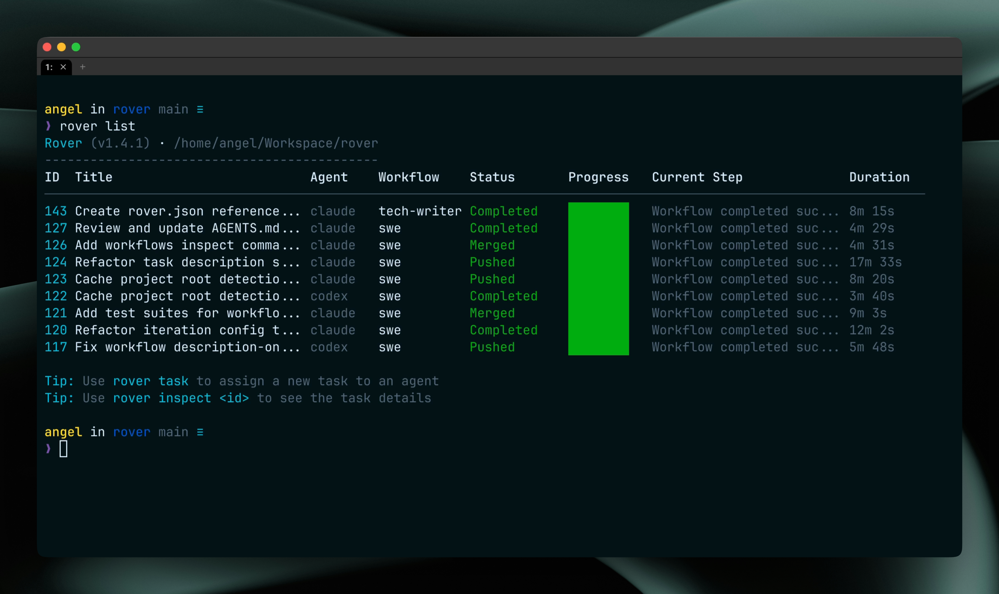

import StepList from '../../../../components/StepList.svelte';
import StepItem from '../../../../components/StepItem.svelte';
import { LinkCard, CardGrid, Tabs, TabItem } from '@astrojs/starlight/components';

**Rover is a manager on top of AI coding agents** such as Claude Code, Codex, Gemini, Cursor, and Qwen. Use Rover to **define multiple tasks and assign them to the coding agents** you already use every day.

Rover will prepare an isolated environment for each task and ensure the agents complete it in the background. **No more chat monitoring, context switching, and interruptions**.



## Getting Started

### Prerequisites
- **Node.js 22** or newer
- **Git**
- **Docker** or **Podman**
- **Supported AI Agent** ([Claude Code](https://docs.anthropic.com/en/docs/claude-code/overview#get-started-in-30-seconds), [Codex](https://github.com/openai/codex?tab=readme-ov-file#installing-and-running-codex-cli), [Gemini](https://github.com/google-gemini/gemini-cli?tab=readme-ov-file#quick-install), [Cursor](https://cursor.com/cli) or [Qwen](https://github.com/QwenLM/qwen-code?tab=readme-ov-file#installation))

<StepList title="Installing Rover">
  <StepItem step={1}>
    Install Rover

    <Tabs>
      <TabItem label="npm">
        ```sh
        npm install -g @endorhq/rover@latest
        ```
      </TabItem>
      <TabItem label="pnpm">
        ```sh
        pnpm add -g @endorhq/rover@latest
        ```
      </TabItem>
    </Tabs>
  </StepItem>
  <StepItem step={2}>
    Visit your git tracked project

    ```sh
    cd ~/my-project
    ```
  </StepItem>
  <StepItem step={3}>
    Initialize Rover in the project

    ```sh
    rover init
    ```
  </StepItem>
  <StepItem step={4}>
    Create your first task

    ```sh
    rover task
    ```
  </StepItem>
</StepList>

After completing these steps, follow the tips that Rover will give you to continue. You can also check the [quickstart guide](/rover/intro/quickstart) for a more complete introduction.

## What Rover does for you

- **Assign a full task** (like GitHub issue or Jira ticket). Rover will take care of breaking it down into steps so an AI agent can complete it autonomously
- **Develop a test suite** for a class while you continue working on a different one. When you are ready, review and merge the test suite changes
- **Write the user documentation** for a new feature. Get high-quality documentation following the best practices
- **Automate repetitive tasks** like code refactoring or adding logging. Create a task, and let the agent do the work while you focus on more important things
- And much more!

## Why developers love Rover

- **Work on multiple tasks at the same time**: Rover creates isolated environments for each task, allowing AI agents to work autonomously without interference
- **Reduce context switching**: each task runs in the background. The coding agents will produce a set of documents and code changes that you can review when ready
- **Meet where you are**: Rover works with the coding agents you already use, no need to sign up for new services or subscriptions
- **Ensure consistency across AI coding agents and teams**: get a consistent environment and workflow for all your coding agents, and share it with your team
- **It's Open Source**: Released under Apache 2.0 license. You can check the code and contribute

## Community

We'd love to hear from you! Whether you have questions, feedback, or want to share what you're building with Rover, there are multiple ways to connect.

- **Discord**: [Join our Discord spaceship](https://discord.gg/ruMJaQqVKa) for real-time discussions and help
- **Twitter/X**: Follow us [@EndorHQ](https://twitter.com/EndorHQ) for updates and announcements
- **Mastodon**: Find us at [@EndorHQ@mastodon.social](https://mastodon.social/@EndorHQ)
- **Bluesky**: Follow [@endorhq.bsky.social](https://bsky.app/profile/endorhq.bsky.social)

## Next Steps

<CardGrid>
  <LinkCard title="Quickstart" href="/rover/intro/quickstart" description="Get started with Rover in minutes with our step-by-step quickstart guide" />
  <LinkCard title="Implement a complete feature" href="/rover/guides/assign-tasks" description="Create and assign tasks to AI coding agents" />
  <LinkCard title="Merge changes from tasks" href="/rover/guides/merge-tasks" description="Integrate completed tasks into your codebase" />
  <LinkCard title="VSCode Extension" href="/rover/intro/vscode-extension" description="Integrate Rover with VSCode to manage tasks without leaving your IDE" />
</CardGrid>